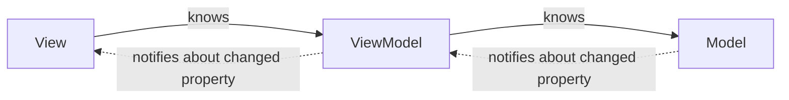
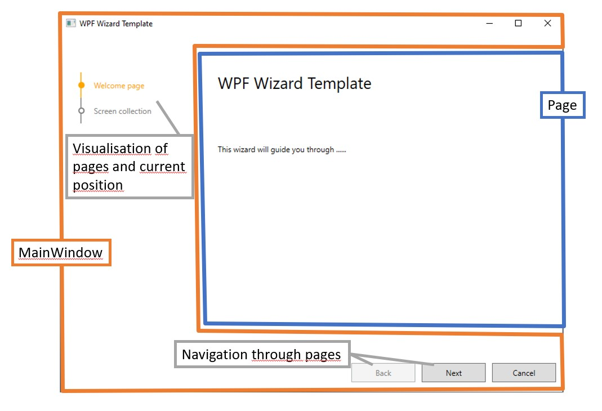
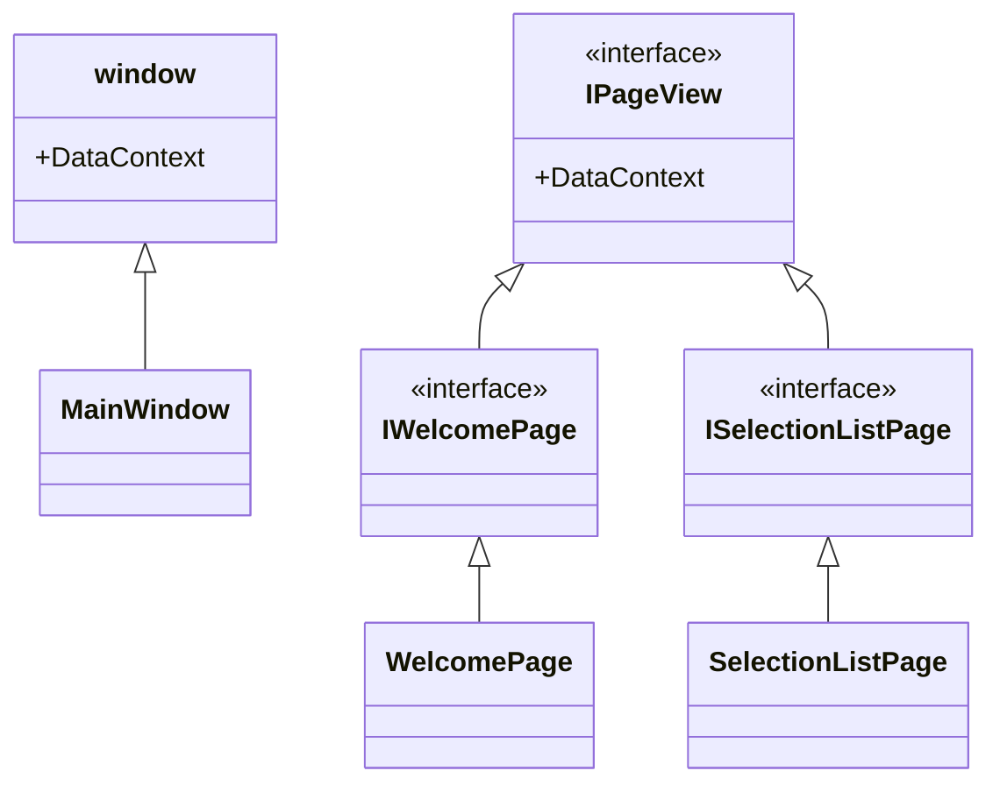
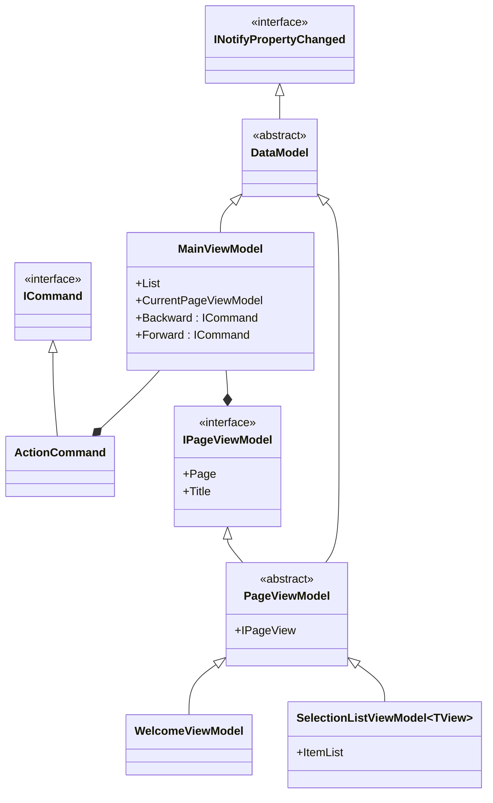

# The Editor Wizard with WPF GUI
This Engineering Studio wizard extention has been added to the COPA-DATA Developer tool in order to give a basic example on how to properly implement the MVVM pattern.
This README gives you an overview over all the used classes and their usage.

## Prerequisites
If the MVVM pattern is completely new to you, it is recommended to read an article about this famous pattern first. [Here is a link to a documentation on docs.micrsosoft.com](https://docs.microsoft.com/en-us/xamarin/xamarin-forms/enterprise-application-patterns/mvvm) alternatively [here is a link to the wikipedia article](https://en.wikipedia.org/wiki/Model%E2%80%93view%E2%80%93viewmodel) 


The **view** is responsible for defining the structure, layout, and appearance of what the user sees on screen. Ideally, the **view** binds to properties in the **view model**.

The **view model** implements properties and commands to which the view can data bind to, and notifies the view of any state changes through change notification events. The properties and commands that the **view model** provides define the functionality to be offered by the UI, but the view determines how that functionality is to be displayed.

**Model** classes are non-visual classes that encapsulate the app's data. Therefore, the **model** can be thought of as representing the app's domain model, which usually includes a data model along with business and validation logic.

## Graphical experience
Create a project of this Extention, compile it, deploy it and start it in the zenon Engineering Studio to get an Idea of the 'look and feel' of the wizard.



The GUI is built as a main view consisting of a frame and fille with several pages. There is a forward and backward button where you can switch between the pages. In the main view is a graphical visualisation of the list of the pages and the current position within it.

## Class Diagram
To give you an overview over the automatically created classes, the functionality is described by the help of class diagrams. All parts (classes and interfaces) are explanined separately.

## View


First, Lets focus on the **View** part. As it can be seen in the class diagram, the views are separated in two types: window and pages. These are rather unconnected to each other. The interface `IPageView` provides a `DataContext` (**ViewModel**) to the sub pages. The `MainWindow` gets the `DataContext` from the parent windows class. The `MainWindow` embeds also some `ResourceDictionary` which is described in an own file: ControlResources.xaml. This control resource provides a graphical overview for the navigation in the several pages.

Have a look on some WPF documentation if you are unfamiliar on how a window, a form or a element is described and placed in WPF. There is a designer for WPF included in Microsoft Visual Studio. It is however also recommended to make some improvments to the designer generated information *.xaml file. 

The code in the xaml view is rather empty, because all visual parts - like lists or buttons - are bound to properties of the DataContext (ViewModel) using a technique called 'Binding' (in WPF).

## ViewModel




### DataModel
The DataModel implements the [INotifyPropertyChanged interface](https://docs.microsoft.com/en-us/dotnet/api/system.componentmodel.inotifypropertychanged?view=net-5.0). So, whenever a property is changed in the DataModel (or rather in any of its child classes), the view is notified to update. 

Remember that in the MVVM pattern the **View** knows about the **ViewModel** but not vice versa. The **views** in this wizard hold the **view model** in their `DataContext` property. With the notification of a changed property, the **view model** 'tells' the **view**, that a property has been changed and it can update itself.

### MainViewModel
Upon construction, the `MainViewModel` gets a list of `PageViewModels`. The `MainViewModel` provides a navigation through this list by two commands: _Forward_ and _Backward_. These commands are objects of the class `ActionCommand` which is an own implementation of the `ICommand` interface. The `ActionCommand` get an _Action_ (the actual navigation in the `PageViewModel` list) and a _Predicate_ (this tells the view, if a forward or backward navigation is possible).

The `MainViewModel` also has a property which reports the `CurrentPageViewModel`. This property gets exchanged by other `PageViewModels` from the list when the commands _Forward_ or _Backward_ are triggered. Whenever this property gets set, the `OnPropertyChanged`event is fired. This subsequently informs the view to update.

### PageViewModel
These classes gather detailed information about a specific topic in the wizard. A simple _Welcome Page_ and a _Selection List Page_ displaying all screens in the current project are implemented as an example. These specific `PageViewModels` can be adapted and/extended to your own needs.

## Model

The Model - the data - originates from the zenon API itself. All is tied together in the _Run_ method of the `EditorWizardExtention`. Let's focus on some lines of code. The explanation to the code is underneath of each code listing.

```cs
var pageViewModels = new List<IPageViewModel>
  {
    new WelcomeViewModel<WelcomePage>(),
    new SelectionListViewModel<SelectionListPage>(context.Workspace.ActiveProject.ScreenCollection)
  };
```
Here, the list of `IPageViewModels` is created. As list items, it holds a `WelcomeViewModel` with a type parameter `WelcomePage` and a `SelectionListViewModel` with a type parameter `SelectionListPage`. The selection list page gets the screen collection of the current active project in the workspace and stores it in a property.

#### Some information about the type parameters:
The type parameters are needed to define, which view shall be used when the page is used.

```cs
[PageViewModel]

public abstract class PageViewModel<TPageView> : DataModel, IPageViewModel where TPageView : IPageView, new()
{
  private TPageView _pageView;

  public virtual object Page
  {
    get
    {
      if (_pageView == null)
      {
        _pageView = new TPageView { DataContext = this };
      }
      return _pageView;
    }
  }
```
This code describes, that when a `PageViewModel` is constructed, the corresponding view (given in the type parameter) is created. The page view model has the view in a private field. Vice versa, when the page view is constructed, the `DataContext` property of the view is set to `this` - the calling page view model.

Corresponding to the above, the current page gets set when a navigation _Forward_ or _Backward_ is triggered. The value change has a defined `get`-method:

```cs
[SelectionListViewModel]

    public IEnumerable<IScreen> ItemList
    {
      get { return _itemList; }
      private set
      {
        if (!Equals(_itemList, value))
        {
          _itemList = value;
          OnPropertyChanged();
        }
      }
    }
```

 By assigning a value to the `ItemList` property, the `OnPropertyChanged` event is raised. 

 Back to the `MainViewModel`:

```cs
var mainViewModel =  new MainViewModel(pageViewModels);
```
Next, the `MainViewModel` is constructed and the list of `pageViewModels`are stored in it.

```cs
var mainView = new MainView 
  { 
    DataContext = mainViewModel 
  };
mainView.ShowDialog();
```
This last code listing shows the construction of the `MainView` which takes the previously created `mainViewModel` in the `DataContext` property. Since everything is prepared, the dialogue is shown.


